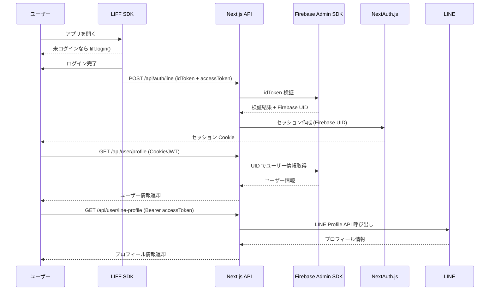

# 認証ガイド

## 1. 概要
このドキュメントは。

- フロントエンド：Next.js (App Router) + LIFF SDK
- バックエンド：Firebase Auth / Cloud Functions
- 認証管理：NextAuth.js
- データ管理：Firestore

---

## 2. 認証フロー

1. ユーザーがアプリを開くと LIFF SDK が起動
2. ユーザー未ログインの場合、`liff.login()` で LINE ログイン
3. LIFF から `idToken`,`accessToken`  を取得（JWT形式）
4. サーバーの API Route に送信
5. Firebase Admin SDK で `idToken` を検証
6. Firebase カスタムトークンを発行
7. NextAuth.js のセッションに `firebaseUid` と LINE ユーザーID を格納
8. セッション Cookie を通じて SSR/CSR 両方で利用可能

---
## 🔄 シーケンス図


---

## 3. フロントエンド例 (LIFF)

```ts
import liff from "@line/liff";

export async function loginWithLiff() {
  await liff.init({ liffId: process.env.NEXT_PUBLIC_LIFF_ID! });

  if (!liff.isLoggedIn()) {
    liff.login();
    return;
  }

  const idToken = liff.getIDToken();
  const accessToken = liff.getAccessToken();
  const profile = await liff.getProfile();

  await fetch("/api/auth/line", {
    method: "POST",
    headers: { "Content-Type": "application/json" },
    body: JSON.stringify({ idToken, accessToken, profile }),
  });
}
