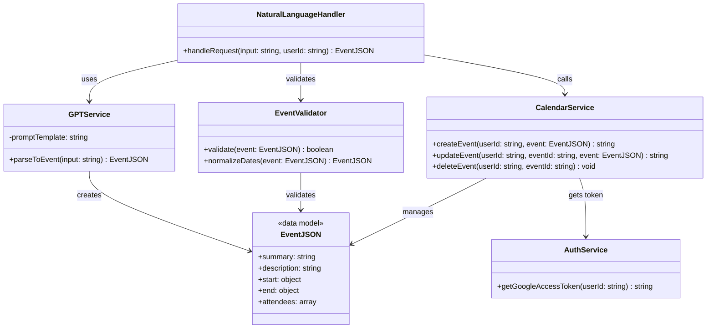

# Calendar System Class Diagram

This document describes the class structure and relationships for the AI Assistant's calendar integration system. The system processes natural language input through Cloud Functions and integrates with Google Calendar API to create, update, and delete calendar events.

## Overview

The calendar system is built on Google Cloud Functions and consists of several key components that work together to process natural language requests and manage calendar events through Google Calendar API integration. The system uses Firebase Authentication with Google Identity Platform for user management and GPT API for natural language processing.

## Class Diagram




## Class Descriptions

### NaturalLanguageHandler
**Role**: Cloud Functions entry point for processing natural language calendar requests
- **handleRequest()**: Receives user input (natural language + user ID) and orchestrates the entire processing flow
- **Responsibilities**: 
  - Acts as the main entry point for Cloud Functions
  - Coordinates the interaction between GPT parsing, validation, and calendar operations
  - Manages the complete request lifecycle from input to response

### GPTService
**Role**: GPT API integration for natural language to structured data conversion
- **parseToEvent()**: Calls GPT API to convert natural language input into Google Calendar event JSON format
- **promptTemplate**: Contains few-shot prompts and JSON mode configurations for consistent parsing
- **Responsibilities**: 
  - Natural language understanding and event data extraction
  - GPT API integration with proper prompt engineering
  - JSON mode configuration for structured output

### EventValidator
**Role**: Data validation and normalization using Zod/JSON Schema
- **validate()**: Validates GPT output using Zod/JSON Schema to ensure data integrity
- **normalizeDates()**: Converts relative date expressions (e.g., "tomorrow", "next week") to ISO8601 format
- **Responsibilities**: 
  - Schema validation using Zod/JSON Schema
  - Date normalization and timezone handling
  - Error prevention and data quality assurance

### CalendarService
**Role**: Google Calendar API wrapper for calendar operations
- **createEvent()**: Creates new calendar events through Google Calendar API
- **updateEvent()**: Modifies existing events with new data
- **deleteEvent()**: Removes events from the calendar
- **Responsibilities**: 
  - Direct interaction with Google Calendar API
  - Event lifecycle management (create, update, delete)
  - API response handling and error management

### AuthService
**Role**: Authentication and authorization using Firebase Authentication + Google Identity Platform
- **getGoogleAccessToken()**: Retrieves user-specific access tokens for Google Calendar API calls
- **Responsibilities**: 
  - Firebase Authentication integration
  - Google Identity Platform token management
  - User authentication and API access control
  - OAuth token refresh and validation

### EventJSON
**Role**: Data model conforming to Google Calendar API event structure
- **summary**: Event title/subject
- **description**: Detailed event description
- **start**: Event start date and time (ISO8601 format)
- **end**: Event end date and time (ISO8601 format)
- **attendees**: Array of participant email addresses
- **Responsibilities**: 
  - Standardized data structure for Google Calendar API compatibility
  - Type safety and data consistency
  - API contract compliance

## System Flow

1. **Cloud Functions Entry**: User sends natural language request to `NaturalLanguageHandler` (Cloud Functions entry point)
2. **GPT Processing**: `GPTService` calls GPT API with few-shot prompts and JSON mode to convert natural language to structured `EventJSON`
3. **Schema Validation**: `EventValidator` validates GPT output using Zod/JSON Schema and normalizes relative dates to ISO8601 format
4. **Authentication**: `AuthService` retrieves user-specific access tokens using Firebase Authentication + Google Identity Platform
5. **Calendar Operations**: `CalendarService` performs Google Calendar API calls (create, update, delete events)
6. **Response**: System returns confirmation or event details to the user

## Technical Architecture

### Cloud Functions Integration
- **Entry Point**: `NaturalLanguageHandler` serves as the Cloud Functions HTTP trigger
- **Scalability**: Serverless architecture for automatic scaling
- **Cold Start**: Optimized for minimal cold start times

### GPT API Integration
- **Few-shot Learning**: Uses example prompts for better parsing accuracy
- **JSON Mode**: Configured for structured output format
- **Error Handling**: Robust error handling for API failures

### Data Validation Pipeline
- **Zod Schema**: Type-safe validation using Zod schemas
- **JSON Schema**: Additional validation layer for data integrity
- **Date Normalization**: Converts relative expressions ("tomorrow", "next week") to absolute ISO8601 timestamps

### Authentication Flow
- **Firebase Auth**: User authentication and session management
- **Google Identity Platform**: OAuth token management
- **Token Refresh**: Automatic token refresh for long-running operations

## Dependencies

- **Google Cloud Functions**: Serverless compute platform
- **Google Calendar API**: Calendar operations and event management
- **GPT API**: Natural language processing and structured data extraction
- **Firebase Authentication**: User authentication and session management
- **Google Identity Platform**: OAuth 2.0 token management
- **Zod**: Type-safe schema validation
- **JSON Schema**: Additional data validation layer
- **Date/Time Libraries**: Date normalization and timezone handling


```mermaind
sequenceDiagram
    participant Client
    participant Controller as NaturalLanguageController
    participant AI as AIService
    participant Calendar as CalendarService
    participant Google as GoogleCalendarClient

    Client->>Controller: POST /api/addSchedule (text)
    Controller->>AI: parseToEventData(text)
    AI-->>Controller: CalendarEventData
    Controller->>Calendar: createEvent(eventData)
    Calendar->>Google: insertEvent(eventData)
    Google-->>Calendar: eventId
    Calendar-->>Controller: success
    Controller-->>Client: 200 OK (eventId)

```

```
graph TD
    A[POST /calendar] --> B[NaturalLanguageHandler.handleRequest]
    B --> C[GPTService.parseToEvent]
    C --> D[EventValidator.validate]
    D --> E[EventValidator.normalizeDates]
    E --> F[CalendarService.createEvent]
    F --> G[AuthService.getGoogleAccessToken]
    G --> H[Google Calendar API]
    H --> I[Return EventJSON]
```