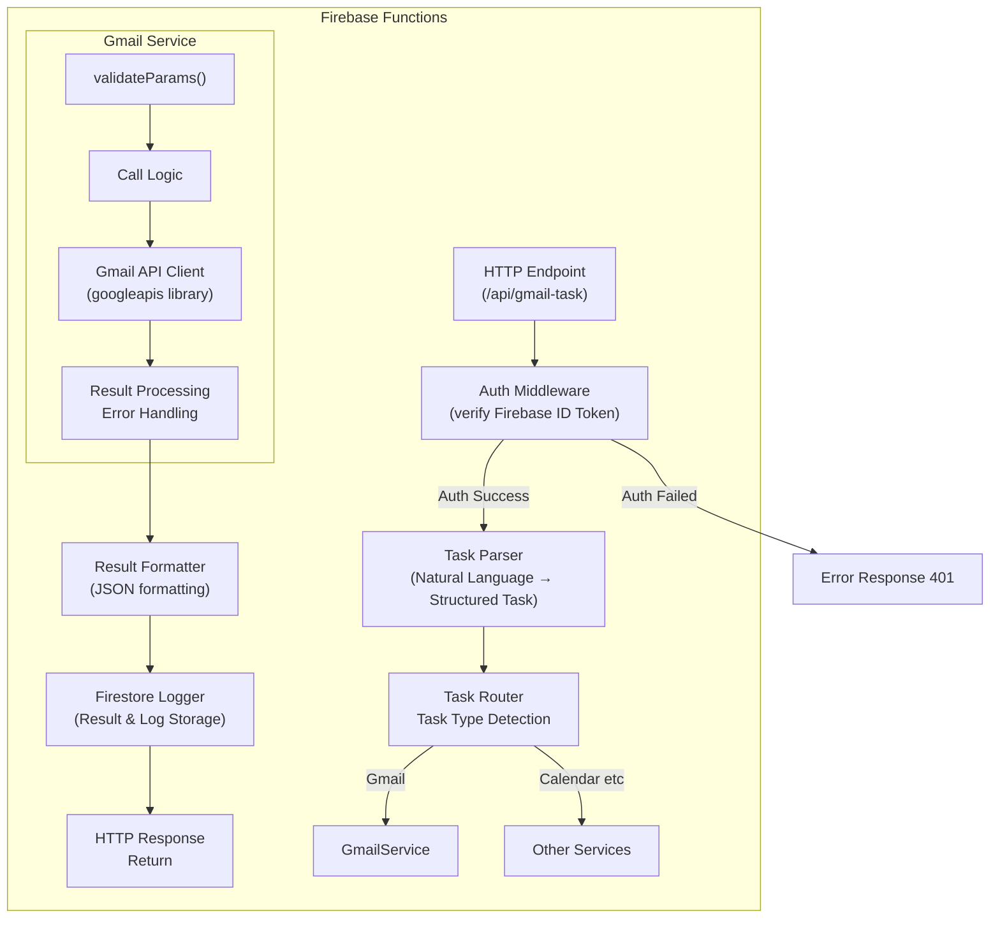

```mermaid
flowchart TD

subgraph CF["Firebase Functions"]
    A["HTTP Endpoint<br/>(/api/gmail-task)"] --> B["Auth Middleware<br/>(verify Firebase ID Token)"]
    B -->|"Auth Success"| C["Task Parser<br/>(Natural Language → Structured Task)"]
    C --> D["Task Router<br/>Task Type Detection"]
    D -->|"Gmail"| E["GmailService"]
    D -->|"Calendar etc"| Z["Other Services"]

    subgraph GmailService["Gmail Service"]
        E1["validateParams()"] --> E2["Call Logic"]
        E2 --> E3["Gmail API Client<br/>(googleapis library)"]
        E3 --> E4["Result Processing<br/>Error Handling"]
    end

    E4 --> F["Result Formatter<br/>(JSON formatting)"]
    F --> G["Firestore Logger<br/>(Result & Log Storage)"]
    G --> H["HTTP Response<br/>Return"]
end

B -->|"Auth Failed"| X["Error Response 401"]
```
